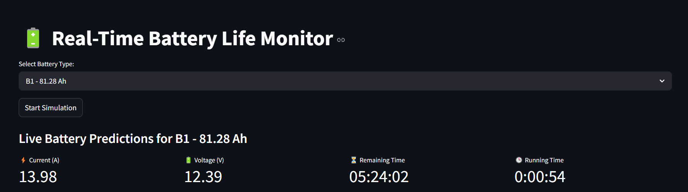
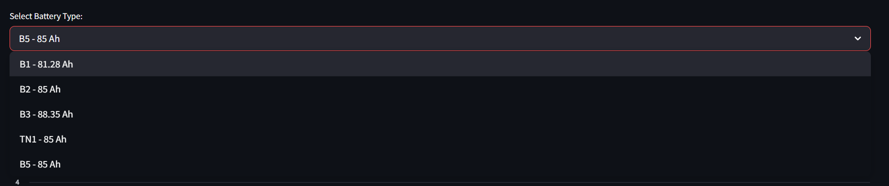
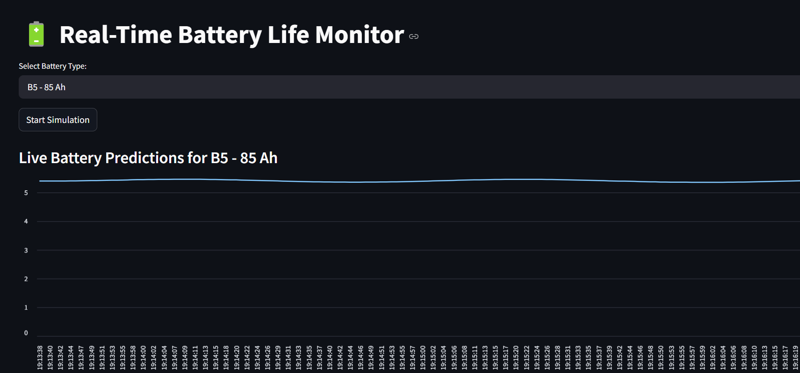
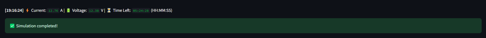

# 🔋 Battery Life Predictor (LSTM-based)

A real-time battery life predictor using an LSTM model trained on minute-by-minute battery discharge data. It includes Streamlit UI, simulation, and deployment-ready structure.

---

## 📁 Project Structure

```
BATTEY_GAUGE/
│
├── data/
│   ├── excel/                     # Original Excel sheets
│   ├── Merged/                    # Merged dataset (optional)
│   └── processed/                 # Cleaned per-test CSVs
│
├── models/                       # Trained LSTM model and scalers
│   ├── battery_lstm_model.keras
│   ├── input_scaler.pkl
│   └── target_scaler.pkl
│
├── scripts/                      # Core training + utility scripts
│   ├── train_lstm_model.py       # Trains the LSTM model
│   ├── predict_battery_time.py   # Real-time simulation
│   └── process_battery_sheets.py # Excel → processed CSV
│
├── webpage/                      # Streamlit frontend
│   └── battery_life_gui.py
│
├── images/                       # UI Screenshots
│   ├── Battery_type.png
│   ├── Dashboard.png
│   ├── detail.png
│   └── Graph.png
│
├── requirements.txt             # Python dependencies
└── .gitignore
```

---

## 🚀 Features

- ⚙️ LSTM-based time-series predictor for battery discharge percentage
- 📊 Real-time simulation of current, voltage & remaining capacity
- 🧠 Battery metadata handling (type, capacity, charge level)
- 📈 Streamlit-based live dashboard (graph + stats)
- 🧪 Per-test processing to improve realism (no unrealistic jumps)
- 🔁 Live prediction every 30 seconds with realistic variation

---

## 📸 UI Snapshots

### 📊 Streamlit Dashboard


### 🔋 Battery Type Selection


### 📈 Discharge Graph


### 🔍 Detail View


---

## 🧪 Dataset Overview
- **Sources**: Individual CSVs from minute-wise battery discharge testing
- **Metadata**: battery type, total capacity, charged level
- **Range**: Voltage drops from ~13V to ~9.3V before death

### Example:
```
test1 → b5, 85Ah, full charge
343 rows → battery lasted 343 minutes
```

---

## 🧠 Model Details
- Type: LSTM (2-layer)
- Input: last 30 minutes of features
- Output: Discharge % (scaled + smoothed)
- Features:
  - Current
  - Voltage
  - Ah Out
  - Cumulative Discharge Ah
  - Power
  - Remaining Capacity
  - Battery Capacity
  - Charged Upto
  - Battery Type (One-hot)

---

## 🛠️ To Train the Model
```bash
cd scripts
python train_lstm_model.py
```

---

## 💡 To Run Streamlit Dashboard
```bash
cd webpage
streamlit run battery_life_gui.py
```

---

## 📦 Requirements
Install Python dependencies:
```bash
pip install -r requirements.txt
```

---

## 🧠 Author
**Dar Sahran**  
AI + IoT Innovator | Data Science | Robotics

---

## 📄 License
MIT License

